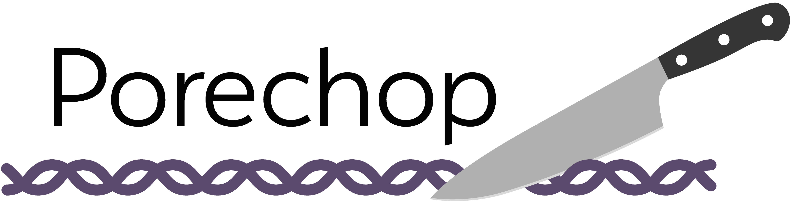
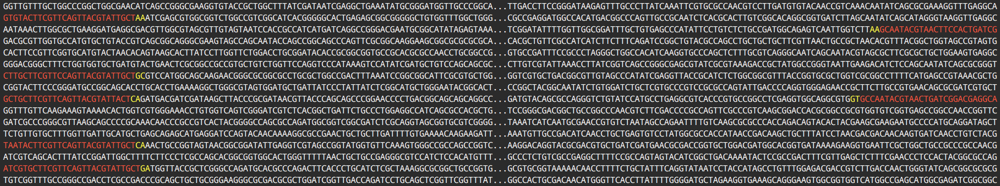
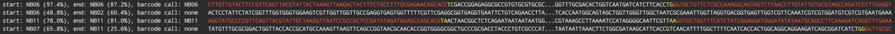
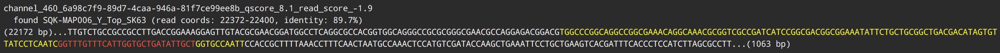

<p align="center"></p>

Porechop is a tool for finding and removing adapters from [Oxford Nanopore](https://nanoporetech.com/) reads. Adapters on the ends of reads are trimmed off, and when a read has an adapter in its middle, it is treated as chimeric and chopped into separate reads. Porechop performs thorough alignments to effectively find adapters, even at low sequence identity.

Porechop also supports demultiplexing of Nanopore reads that were barcoded with the [Native Barcoding Kit](https://store.nanoporetech.com/native-barcoding-kit-1d.html), [PCR Barcoding Kit](https://store.nanoporetech.com/pcr-barcoding-kit-96.html) or [Rapid Barcoding Kit](https://store.nanoporetech.com/rapid-barcoding-sequencing-kit.html).


### Oct 2018 update: Porechop is officially unsupported

While I'm happy Porechop has so many users, it has always been a bit klugey and a pain to maintain. I don't have the time to give it the attention it deserves, so I'm going to now officially declare Porechop as abandonware (though the unanswered [issues](https://github.com/rrwick/Porechop/issues) and [pull requests](https://github.com/rrwick/Porechop/pulls) reveal that it already has been for some time). I've added a [known issues](#known-issues) section to the README to outline what I think is wrong with Porechop and how a reimplementation should look. I may someday (no promises though :stuck_out_tongue:) try to rewrite it from a blank canvas to address its faults.


# Table of contents

* [Requirements](#requirements)
* [Installation](#installation)
    * [Install from source](#install-from-source)
    * [Build and run without installation](#build-and-run-without-installation)
* [Quick usage examples](#quick-usage-examples)
* [How it works](#how-it-works)
    * [Find matching adapter sets](#find-matching-adapter-sets)
    * [Trim adapters from read ends](#trim-adapters-from-read-ends)
    * [Split reads with internal adapters](#split-reads-with-internal-adapters)
    * [Discard reads with internal adapters](#discard-reads-with-internal-adapters)
    * [Barcode demultiplexing](#barcode-demultiplexing)
    * [Barcode demultiplexing with Albacore](#barcode-demultiplexing-with-albacore)
    * [Output](#output)
    * [Verbose output](#verbose-output)
* [Known adapters](#known-adapters)
* [Full usage](#full-usage)
* [Known issues](#known-issues)
* [Acknowledgements](#acknowledgements)
* [License](#license)


# Requirements

* Linux or macOS
* [Python](https://www.python.org/) 3.4 or later
* C++ compiler
    * If you're using [GCC](https://gcc.gnu.org/), version 4.9.1 or later is required (check with `g++ --version`).
    * Recent versions of [Clang](http://clang.llvm.org/) and [ICC](https://software.intel.com/en-us/c-compilers) should also work (C++14 support is required).

I haven't tried to make Porechop run on Windows, but it should be possible. If you have any success on this front, let me know and I'll add instructions to this README!


#  Installation

### Install from source

Running the `setup.py` script will compile the C++ components of Porechop and install a `porechop` executable:

```bash
git clone https://github.com/rrwick/Porechop.git
cd Porechop
python3 setup.py install
porechop -h
```

Notes:
* If the last command complains about permissions, you may need to run it with `sudo`.
* Install just for your user: `python3 setup.py install --user`
    * If you get a strange "can't combine user with prefix" error, read [this](http://stackoverflow.com/questions/4495120).
* Install to a specific location: `python3 setup.py install --prefix=$HOME/.local`
* Install with pip (local copy): `pip3 install path/to/Porechop`
* Install with pip (from GitHub): `pip3 install git+https://github.com/rrwick/Porechop.git`
* If you'd like to specify which compiler to use, set the `CXX` variable: `export CXX=g++-6; python3 setup.py install`
* Porechop includes `ez_setup.py` for users who don't have [setuptools](https://pypi.python.org/pypi/setuptools) installed, though that script is [deprecated](https://github.com/pypa/setuptools/issues/581). So if you run into any installation problems, make sure setuptools is installed on your computer: `pip3 install setuptools`


### Build and run without installation

By simply running `make` in Porechop's directory, you can compile the C++ components but not install an executable. The program can then be executed by directly calling the `porechop-runner.py` script.

```bash
git clone https://github.com/rrwick/Porechop.git
cd Porechop
make
./porechop-runner.py -h
```


# Quick usage examples

__Basic adapter trimming:__<br>
`porechop -i input_reads.fastq.gz -o output_reads.fastq.gz`

__Trimmed reads to stdout, if you prefer:__<br>
`porechop -i input_reads.fastq.gz > output_reads.fastq`

__Demultiplex barcoded reads:__<br>
`porechop -i input_reads.fastq.gz -b output_dir`

__Demultiplex barcoded reads, straight from Albacore output directory:__<br>
`porechop -i albacore_dir -b output_dir`

__Also works with FASTA:__<br>
`porechop -i input_reads.fasta -o output_reads.fasta`

__More verbose output:__<br>
`porechop -i input_reads.fastq.gz -o output_reads.fastq.gz --verbosity 2`

__Got a big server?__<br>
`porechop -i input_reads.fastq.gz -o output_reads.fastq.gz --threads 40`


# How it works

### Find matching adapter sets
 
Porechop first aligns a subset of reads (default 10000 reads, change with `--check_reads`) to all known adapter sets. Adapter sets with at least one high identity match (default 90%, change with `--adapter_threshold`) are deemed present in the sample.

Identity in this step is measured over the full length of the adapter. E.g. in order to qualify for a 90% match, an adapter could be present at 90% identity over its full length, or it could be present at 100% identity over 90% of its length, but a 90% identity match over 90% of the adapter length would not be sufficient.

The [alignment scoring scheme](http://seqan.readthedocs.io/en/master/Tutorial/DataStructures/Alignment/ScoringSchemes.html) used in this and subsequent alignments can be modified using the `--scoring_scheme` option (default: match = 3, mismatch = -6, gap open = -5, gap extend = -2).


### Trim adapters from read ends

The first and last bases in each read (default 150 bases, change with `--end_size`) are aligned to each present adapter set. When a long enough (default 4, change with `--min_trim_size`) and strong enough (default 75%, change with `--end_threshold`) match is found, the read is trimmed. A few extra bases (default 2, change with `--extra_end_trim`) past the adapter match are removed as well to ensure it's all removed.

Identity in this step is measured over the _aligned part_ of the adapter, not its full length. E.g. if the last 5 bases of an adapter exactly match the first 5 bases of a read, that counts as a 100% identity match and those bases will be trimmed off. This allows Porechop to effectively trim partially present barcodes.

The default `--end_threshold` is low (75%) because false positives (trimming off some sequence that wasn't really an adapter) shouldn't be too much of a problem with long reads, as only a tiny fraction of the read is lost.


### Split reads with internal adapters

The entirety of each read is aligned to the present adapter sets to spot cases where an adapter is in the middle of the read, indicating a chimera. When a strong enough match is found (default 85%, change with `--middle_threshold`), the read is split. If the resulting parts are too short (default less than 1000 bp, change with `--min_split_read_size`), they are discarded.

The default `--middle_threshold` (85%) is higher than the default `--end_threshold` (75%) because false positives in this step (splitting a read that is not chimeric) could be more problematic than false positives in the end trimming step. If false negatives (failing to split a chimera) are worse for you than false positives (splitting a non-chimera), you should reduce this threshold (e.g. `--middle_threshold 75`).

Extra bases are also removed next to the hit, and how many depends on the side of the adapter. If we find an adapter that's expected at the start of a read, it's likely that what follows is good sequence but what precedes it may not be. Therefore, a few bases are trimmed after the adapter (default 10, change with `--extra_middle_trim_good_side`) and more bases are trimmed before the adapter (default 100, change with `--extra_middle_trim_bad_side`). If the found adapter is one we'd expect at the end of the read, then the "good side" is before the adapter and the "bad side" is after the adapter.

Here is a real example of the "good" and "bad" sides of an adapter. The adapter is in the middle of this snippet (SQK-NSK007_Y_Top at about 90% identity). The bases to the left are the "bad" side and their repetitive nature is clear. The bases to the right are the "good" side and represent real biological sequence.
```
TGTTGTTGTTGTTATTGTTGTTATTGTTGTTGTATTGTTGTTATTGTTGTTGTTGTACATTGTTATTGTTGTATTGTTGTTATTGTTGTTGTATTATCGGTGTACTTCGTTCAGTTACGTATTACTATCGCTATTGTTTGCAGTGAGAGGTGGCGGTGAGCGTTTTCAAATGGCCCTGTACAATCATGGGATAACAACATAAGGAACGGACCATGAAGTCACTTCT
```


### Discard reads with internal adapters

If you run Porechop with `--discard_middle`, the reads with internal adapters will be thrown out instead of split.

If you plan on using your reads with [Nanopolish](https://github.com/jts/nanopolish), then the `--discard_middle` option is required. This is because Nanopolish first runs [`nanopolish index`](https://github.com/jts/nanopolish#data-preprocessing) to find a one-to-one association between FASTQ reads and fast5 files. If you ran Porechop _without_ `--discard_middle`, then you could end up with multiple separate FASTQ reads which are from a single fast5, and this is incompatible with Nanopolish.

This option is also recommended if you are trimming reads from a demultiplexed barcoded sequencing run. This is because chimeric reads may contain two sequences from two separate barcodes, so throwing them out is the safer option to reduce cross-barcode contamination.


### Barcode demultiplexing

Porechop can also demultiplex the reads into bins based on which barcode was found. This is done by using the `-b` option, which specifies an output directory for the trimmed reads (each barcode in a separate file), instead of `-o`.

Porechop looks for barcodes at the start and end of each read. All barcode matches are found, and if the best match is strong enough (default 75%, change with `--barcode_threshold`) and sufficiently better than the second-best barcode match (default 5% better, change with `--barcode_diff`), then the read is assigned to that barcode bin. E.g. with default settings, if BC01 was found at 79% identity and BC02 was found at 76% identity, the read will not be assigned to a barcode bin because the results were too close. But if you used `--barcode_diff 1`, then that read _would_ be assigned to the BC01 bin.

By default, Porechop only requires a single barcode match to bin a read. If you use the `--require_two_barcodes` option, then it will be much more stringent and assess the start and end of the read independently. I.e. to be binned, the start of a read must have a good match for a barcode and the end of the read must also have a good match for the same barcode. This will result in far more reads failing to be assigned to a bin, but the reads which are assigned have a very high confidence. Note that for some library preps (e.g. the rapid barcoding kit), barcodes may only be at the start of reads, in which case the `--require_two_barcodes` option is not appropriate.

Note that the `--discard_middle` option is always active when demultiplexing barcoded reads. This is because a read with a middle adapter is likely chimeric and the pieces of chimeric reads may belong in separate bins.

Usage examples:
* __Default settings__:<br>
`porechop -i input_reads.fastq.gz -b output_dir`
* __Stringent binning__ (more reads in "none" bin but low risk of misclassified reads):<br>
`porechop -i input_reads.fastq.gz -b output_dir --barcode_threshold 85 --require_two_barcodes`
* __Lenient binning__ (fewer reads in "none" bin but higher risk of misclassification):<br>
`porechop -i input_reads.fastq.gz -b output_dir --barcode_threshold 60 --barcode_diff 1`


### Barcode demultiplexing with Albacore

'What about Albacore's barcode demultiplexing?' I hear you say. 'Does this make Porechop's demultiplexing redundant?' Yes, Albacore v1.0 and later can demultiplex Nanopore reads during basecalling, which is a very nice feature. But Albacore and Porechop sometimes disagree on the appropriate bin for a read.

So if you use Albacore's output directory as input, here's what Porechop will do:
* Load reads from all FASTQ files it finds, noting for each read what Albacore's bin was.
* Call a barcode for each read using its normal demultiplexing logic.
* Take all reads where Porechop and Albacore disagree and put them in the 'none' bin.

For example, Albacore may have put reads into the `barcode02` directory. When Porechop trims and bins these reads, it may put 95% of them in the BC02 bin, but 4% go in the 'none' bin and 1% go into bins for other barcodes. By keeping only the 95% of reads where Albacore and Porechop agree, the risk of misclassification is reduced.


### Output

If Porechop is run with the output file specified using `-o`, it will display progress info to stdout. It will try to deduce the format of the output reads using the output filename (can handle `.fastq`, `.fastq.gz`, `.fasta` and `.fasta.gz`). The `--format` option can be used to override this automatic detection.

Alternately, you can run Porechop with `-b` which specifies a directory for barcode bins. Porechop will then make separate read files in this directory for each barcode sequence (see [Barcode demultiplexing](#barcode-demultiplexing) for more details on the process). The files will be named using the barcode name or "none" if no barcode call was made (e.g. `BC01.fastq.gz`, `BC02.fastq.gz`, `none.fastq.gz`). The reads will be outputted in either `fasta`, `fastq`, `fasta.gz` or `fastq.gz` format, as determined by the input read format or the `--format` option.

If Porechop is run without `-o` or `-b`, then it will output the trimmed reads to stdout and print its progress info to stderr. The output format of the reads will be FASTA/FASTQ based on the input reads, or else can be specified using `--format`.

The `--verbosity` option will change the amount of progress info:
* `--verbosity 0` gives no progress output.
* `--verbosity 1` (default) gives summary info about end adapter trimming and middle adapter splitting.
* `--verbosity 2` shows the actual trimmed/split sequences for each read (described more below).
* `--verbosity 3` shows tons of data (mainly for debugging).


### Verbose output

If you call Porechop with `--verbosity 2`, then it will display the start/end of each read show the trimming in colour. Red indicates the adapter sequence and yellow indicates additional trimmed bases:

<p align="center"></p>


If you are [demultiplexing barcodes](#barcode-demultiplexing), then this output will also show the barcodes found at the start/end of each read, along with the final call for the read's bin:

<p align="center"></p>


The same colour scheme is used for middle adapters, but only reads with a positive hit are displayed:

<p align="center"></p>


# Known adapters

The known Nanopore adapters that Porechop looks for are defined in the [adapters.py](../master/porechop/adapters.py) file.

They are:
* Ligation kit adapters
* Rapid kit adapters
* PCR kit adapters
* Barcodes
* Native barcoding
* Rapid barcoding

If you want to add your own adapter sequences to Porechop, you can do so by editing the [adapters.py](../master/porechop/adapters.py) file (instructions are in that file). And if you know of any adapter sequences that I've missed, please let me know and I'll add them!


# Full usage

```
usage: porechop -i INPUT [-o OUTPUT] [--format {auto,fasta,fastq,fasta.gz,fastq.gz}] [-v VERBOSITY]
                [-t THREADS] [-b BARCODE_DIR] [--barcode_threshold BARCODE_THRESHOLD]
                [--barcode_diff BARCODE_DIFF] [--require_two_barcodes] [--untrimmed]
                [--discard_unassigned] [--adapter_threshold ADAPTER_THRESHOLD]
                [--check_reads CHECK_READS] [--scoring_scheme SCORING_SCHEME] [--end_size END_SIZE]
                [--min_trim_size MIN_TRIM_SIZE] [--extra_end_trim EXTRA_END_TRIM]
                [--end_threshold END_THRESHOLD] [--no_split] [--discard_middle]
                [--middle_threshold MIDDLE_THRESHOLD]
                [--extra_middle_trim_good_side EXTRA_MIDDLE_TRIM_GOOD_SIDE]
                [--extra_middle_trim_bad_side EXTRA_MIDDLE_TRIM_BAD_SIDE]
                [--min_split_read_size MIN_SPLIT_READ_SIZE] [-h] [--version]

Porechop: a tool for finding adapters in Oxford Nanopore reads, trimming them from the ends and
splitting reads with internal adapters

Main options:
  -i INPUT, --input INPUT        FASTA/FASTQ of input reads or a directory which will be
                                 recursively searched for FASTQ files (required)
  -o OUTPUT, --output OUTPUT     Filename for FASTA or FASTQ of trimmed reads (if not set, trimmed
                                 reads will be printed to stdout)
  --format {auto,fasta,fastq,fasta.gz,fastq.gz}
                                 Output format for the reads - if auto, the format will be chosen
                                 based on the output filename or the input read format (default:
                                 auto)
  -v VERBOSITY, --verbosity VERBOSITY
                                 Level of progress information: 0 = none, 1 = some, 2 = lots, 3 =
                                 full - output will go to stdout if reads are saved to a file and
                                 stderr if reads are printed to stdout (default: 1)
  -t THREADS, --threads THREADS  Number of threads to use for adapter alignment (default: 8)

Barcode binning settings:
  Control the binning of reads based on barcodes (i.e. barcode demultiplexing)

  -b BARCODE_DIR, --barcode_dir BARCODE_DIR
                                 Reads will be binned based on their barcode and saved to separate
                                 files in this directory (incompatible with --output)
  --barcode_threshold BARCODE_THRESHOLD
                                 A read must have at least this percent identity to a barcode to be
                                 binned (default: 75.0)
  --barcode_diff BARCODE_DIFF    If the difference between a read's best barcode identity and its
                                 second-best barcode identity is less than this value, it will not
                                 be put in a barcode bin (to exclude cases which are too close to
                                 call) (default: 5.0)
  --require_two_barcodes         Reads will only be put in barcode bins if they have a strong match
                                 for the barcode on both their start and end (default: a read can
                                 be binned with a match at its start or end)
  --untrimmed                    Bin reads but do not trim them (default: trim the reads)
  --discard_unassigned           Discard unassigned reads (instead of creating a "none" bin)
                                 (default: False)

Adapter search settings:
  Control how the program determines which adapter sets are present

  --adapter_threshold ADAPTER_THRESHOLD
                                 An adapter set has to have at least this percent identity to be
                                 labelled as present and trimmed off (0 to 100) (default: 90.0)
  --check_reads CHECK_READS      This many reads will be aligned to all possible adapters to
                                 determine which adapter sets are present (default: 10000)
  --scoring_scheme SCORING_SCHEME
                                 Comma-delimited string of alignment scores: match, mismatch, gap
                                 open, gap extend (default: 3,-6,-5,-2)

End adapter settings:
  Control the trimming of adapters from read ends

  --end_size END_SIZE            The number of base pairs at each end of the read which will be
                                 searched for adapter sequences (default: 150)
  --min_trim_size MIN_TRIM_SIZE  Adapter alignments smaller than this will be ignored (default: 4)
  --extra_end_trim EXTRA_END_TRIM
                                 This many additional bases will be removed next to adapters found
                                 at the ends of reads (default: 2)
  --end_threshold END_THRESHOLD  Adapters at the ends of reads must have at least this percent
                                 identity to be removed (0 to 100) (default: 75.0)

Middle adapter settings:
  Control the splitting of read from middle adapters

  --no_split                     Skip splitting reads based on middle adapters (default: split
                                 reads when an adapter is found in the middle)
  --discard_middle               Reads with middle adapters will be discarded (default: reads with
                                 middle adapters are split) (required for reads to be used with
                                 Nanopolish, this option is on by default when outputting reads
                                 into barcode bins)
  --middle_threshold MIDDLE_THRESHOLD
                                 Adapters in the middle of reads must have at least this percent
                                 identity to be found (0 to 100) (default: 85.0)
  --extra_middle_trim_good_side EXTRA_MIDDLE_TRIM_GOOD_SIDE
                                 This many additional bases will be removed next to middle adapters
                                 on their "good" side (default: 10)
  --extra_middle_trim_bad_side EXTRA_MIDDLE_TRIM_BAD_SIDE
                                 This many additional bases will be removed next to middle adapters
                                 on their "bad" side (default: 100)
  --min_split_read_size MIN_SPLIT_READ_SIZE
                                 Post-split read pieces smaller than this many base pairs will not
                                 be outputted (default: 1000)

Help:
  -h, --help                     Show this help message and exit
  --version                      Show program's version number and exit
```


# Known issues

### Adapter search

Porechop tries to automatically determine which adapters are present by looking at the reads, but this approach has a few issues:

* As the number of kits/barcodes has grown, adapter-search part of the Porechop's pipeline has become increasingly slow.
* Porechop only does the adapter search on a subset of reads, which means there can be problems with non-randomly ordered read sets (e.g. all barcode 1 reads at the start of a file, followed by barcode 2 reads, etc).
* Many ONT adapters share common sequence with each other, making false positive adapter finds possible.

A simpler solution (and in hindsight what I should have done) would be to require the kit and/or adapters from the user.  E.g. `porechop --sqk-lsk109` or `porechop --start_adapt ACGCTAGCATACGT`.


### Performance

Porechop uses [SeqAn](https://github.com/seqan/seqan) to perform its alignments in C++. This library is very flexible, but not as fast as some alternatives, such as [Edlib](https://github.com/Martinsos/edlib).

Another performance issue is that Porechop uses [ctypes](https://docs.python.org/3/library/ctypes.html) to interface with its C++ code. Function calls with ctypes can have a bit of overhead, which means that Porechop cannot use threads very efficiently (it spends too much of its time in the Python code, which is intrinsically non-parallel).


### Barcode demultiplexing

I added demultiplexing to Porechop as an afterthought – it was already looking for barcodes to trim, so why not sort reads by barcodes too? This turned out to be a very useful feature, but in hindsight I think it might be simpler (and easier to maintain) if trimming and demultiplexing functionality were in separate tools.


### Base-space problems

I've encountered a couple of issues where adapter sequences are not properly basecalled, resulting in inconsistent sequence. Porechop trims in base-space, so this is a somewhat intractable problem. See [issue #40](https://github.com/rrwick/Porechop/issues/40) for an example.

These have made me wonder if the adapter trimming should be done in signal-space instead, though that would be a more complex problem to solve. I hope that in the future ONT can integrate this kind of functionality directly into their basecallers.


# Acknowledgements

Porechop was inspired by (and largely coded during) [Porecamp Australia 2017](https://porecamp-au.github.io/). Thanks to the organisers and attendees who helped me realise that a Nanopore adapter trimmer might be a useful tool! I later met David Stoddart from Oxford Nanopore at London Calling 2017, and he helped me get many of the adapter sequences right.

Also I'd like to thank the [SeqAn](https://www.seqan.de/) developers for their great library (Porechop uses SeqAn to perform its alignments).

And of course, many thanks to [Kat Holt](https://holtlab.net/) and [Louise Judd](https://scholar.google.com.au/citations?user=eO22mYUAAAAJ&hl=en) for keeping me well supplied with Nanopore reads!


# License

[GNU General Public License, version 3](https://www.gnu.org/licenses/gpl-3.0.html)
